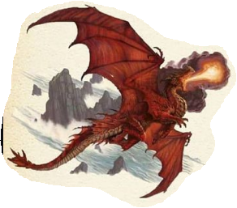
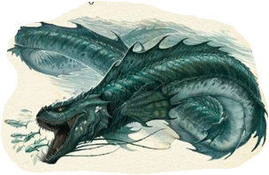
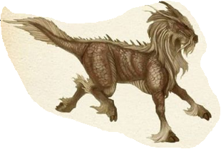

Jennah Levac (20169998), 

Gituhb Link: https://github.com/Jennah2882/BIOL432_A8

```{r, warning=FALSE, message=FALSE}
library(ape)
library(ggplot2)
library(ggtree)
library(viridis)
library(reshape2)
```

Appending our dragons to the existing nexus file

```{r}
nexusFile <- "DragonMatrix.nex"

nexusLines <- readLines(nexusFile)

Entries <- c(
  "75BritishX 100100110000100110000000001110100001001010000000011000010001011100001010011100",
  "76FrenchXX 111100011100000101000100010000010000000000001100000000100000111111100001100001",
  "77DanishXX 10011111000010010010010010100010100000000110000001100001????0111100???11100001")

End <- which(nexusLines == ";")

nexusLines <- append(nexusLines, Entries, after = End - 1)

Final<- gsub("ntax=77", paste0("ntax=80"), nexusLines)

writeLines(Final, "UpdatedDragonMatrix.nex")
```

Create vector of weights

```{r}
WeightsData<-read.csv("Weights.csv")
Weights<-paste0(WeightsData$Weight,collapse="")
Weights<-strsplit(Weights,split="")[[1]]
```

Custom function to convert **letters** to corresponding numeric weight values

```{r}
WeightsNum<-rep(NA,length(Weights))
for(i in 1:length(WeightsNum))
  {if(Weights[i] %in% LETTERS){
    WeightsNum[i]<-which(LETTERS==Weights[i])+9
    } else {
      WeightsNum[i]<-Weights[i]}}
WeightsNum<-as.numeric(WeightsNum)
```

```{r}
WtDragon <- read.nexus.data("UpdatedDragonMatrix.nex")
```

Multiply weight by trait vector for each dragon

```{r}
for (i in 1:length(WtDragon)){
  RepWeight<-WtDragon[[i]]==1
  WtDragon[[i]][RepWeight]<-WeightsNum[RepWeight]
  RepWeight<-NA}
```

```{r}
WtDragonDF<-data.frame(matrix(unlist(WtDragon),ncol=78,byrow=T))
row.names(WtDragonDF)<-names(WtDragon)
```

Distance matrix
```{r}
WtDragonDist<-dist(WtDragonDF,method='euclidean')
```

```{r}
WtDragonDistMat<-as.matrix(WtDragonDist)
```

```{r}
PlotSet<-melt(WtDragonDistMat)
names(PlotSet)<-c("Query","Subject","Distance")
```

```{r}
ggplot(data = PlotSet, aes(x=Query, y=Subject, fill=Distance)) +geom_tile() +scale_fill_viridis(option="magma") +theme(axis.text.x = element_text(angle = 90, hjust = 1, vjust = 0.5))
```
Figure 1:

Dragon images and source







Link: <https://www.pinterest.com/pin/229331806013911066/>

Phylogeny by country of origin
```{r}
WtDragonTree<-nj(WtDragonDist)
p<- ggtree(WtDragonTree,layout="rectangular")
```

```{r}
Country<-gsub("[0-9\\.]+([^X]+)X*","\\1",WtDragonTree$tip.label)
CountryGroups<-split(WtDragonTree$tip.label, Country)
WtDTcol<-groupOTU(WtDragonTree,CountryGroups)
Tree<- ggtree(WtDTcol,layout="rectangular",aes(colour=group)) +geom_tiplab(size=2)
```

```{r}
highlight <- c("British" = "blue", "French" = "red", "Danish" = "green")

tip_labels <- WtDragonTree$tip.label
highlight_tips <- c("75BritishX", "76FrenchXX", "77DanishXX")

highlight_nodes <- which(tip_labels %in% highlight_tips)

Tree + 
  geom_hilight(node = highlight_nodes[1], fill = highlight["British"], alpha = 0.5) +
  geom_hilight(node = highlight_nodes[2], fill = highlight["French"], alpha = 0.5) +
  geom_hilight(node = highlight_nodes[3], fill = highlight["Danish"], alpha = 0.5) +
  theme_tree2() +
  ggtitle("Dragon Phylogeny with Highlighted Lineages") +
  theme(plot.title = element_text(hjust = 0.6, face = "bold"), legend.text = element_text(size = 10), legend.title = element_text(size = 12), legend.key.size = unit(10, "pt")) + labs(color= "Origin")
```
Figure 2: 

Backstory and data interpretation: